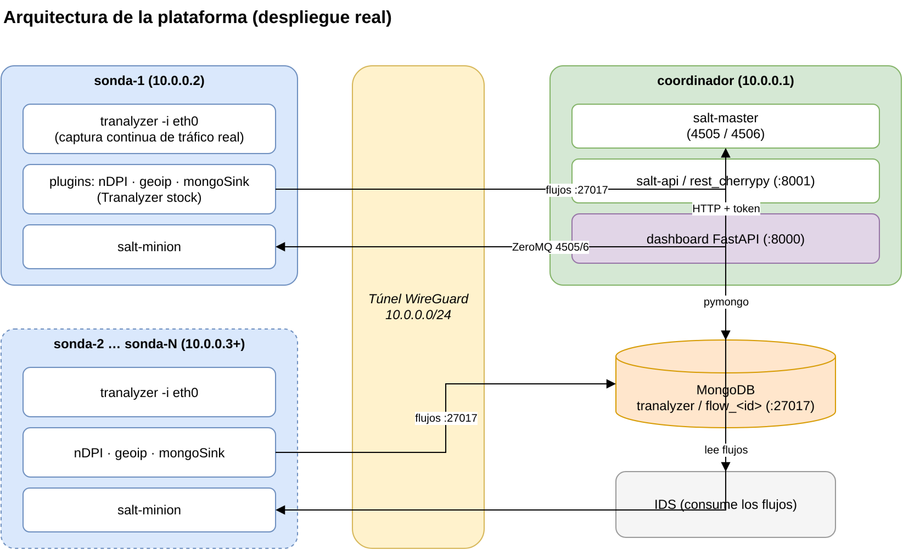
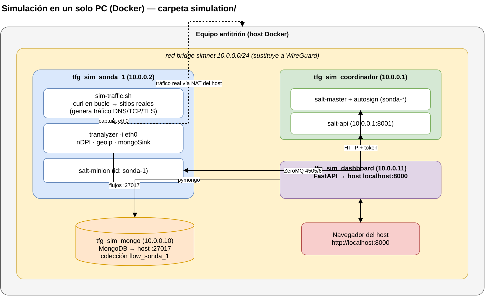
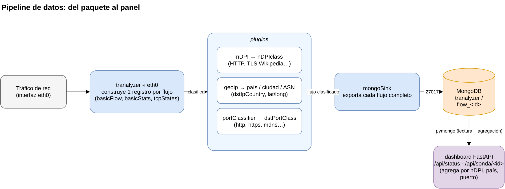
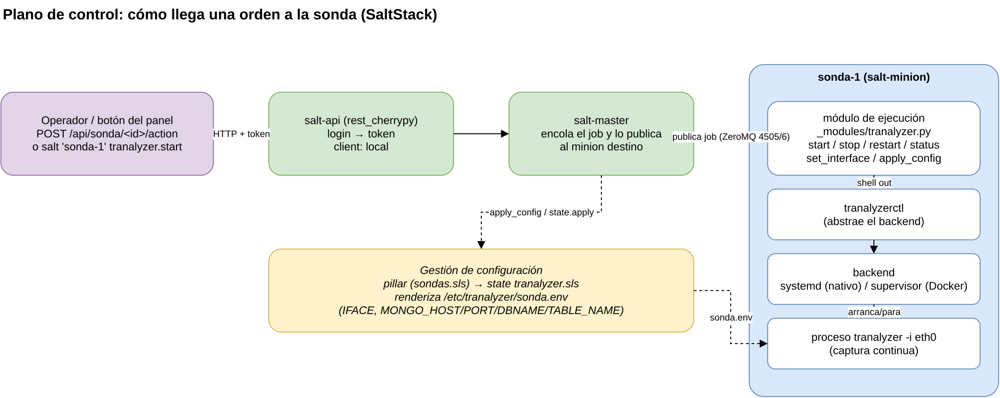

# Diagramas

Diagramas del proyecto.

## Arquitectura (despliegue real)

Flota de sondas, coordinador (salt-master/api + panel), MongoDB e IDS,
todo sobre el túnel WireGuard `10.0.0.0/24`.

## Simulación en un solo PC

Contenedores Docker sobre la red bridge `simnet` (`simulation/`), con el
generador de tráfico sintético.

## Pipeline de datos

Del paquete en `eth0` → Tranalyzer + plugins (nDPI, geoip, portClassifier) →
mongoSink → MongoDB → agregación en el panel.

## Plano de control (SaltStack)

Recorrido de una orden (botón del panel o `salt ...`) hasta la sonda vía
salt-api → master → minion → módulo `tranalyzer` → `tranalyzerctl` → backend,
junto con la gestión de configuración por pillar/state.

